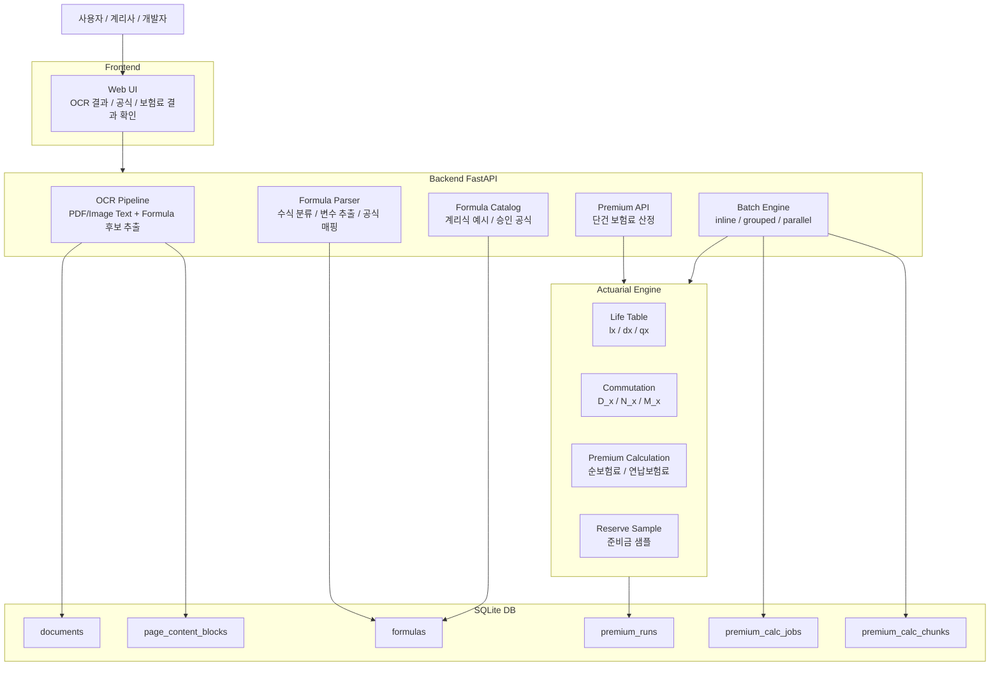
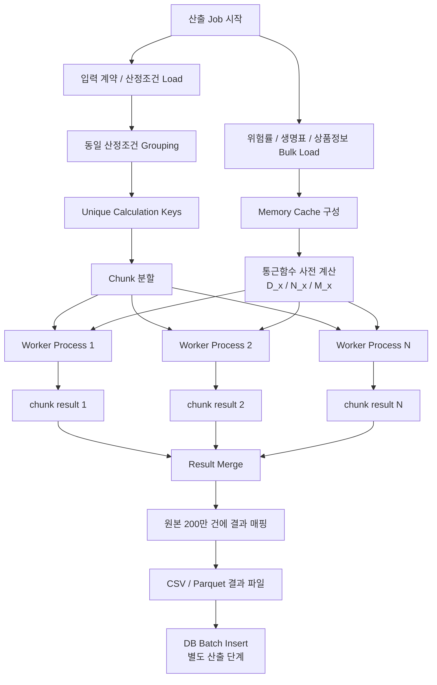
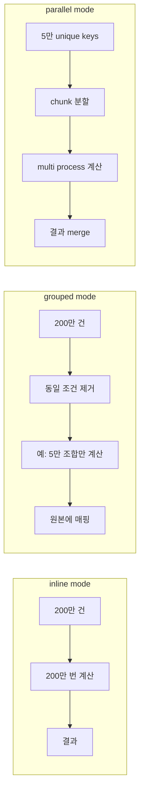
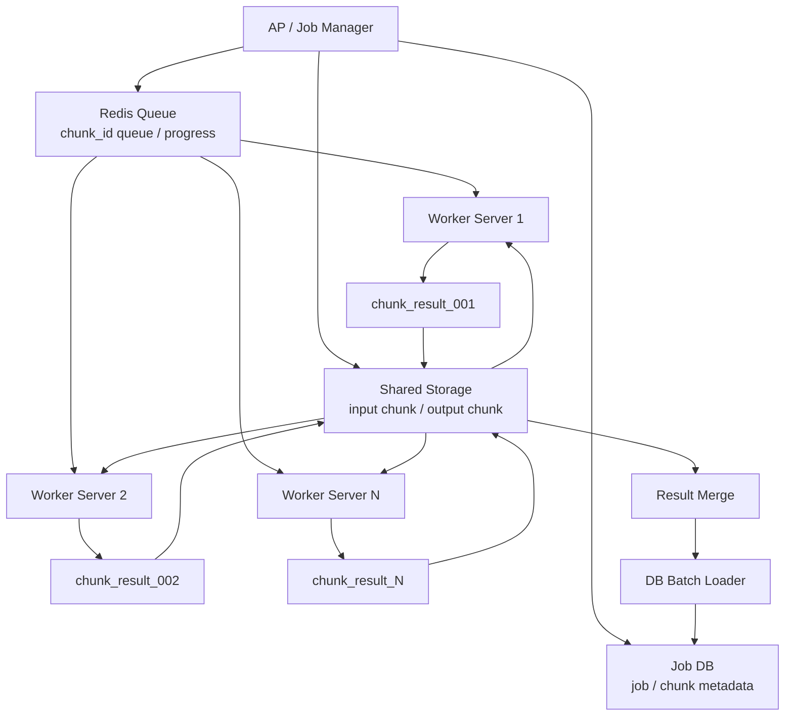
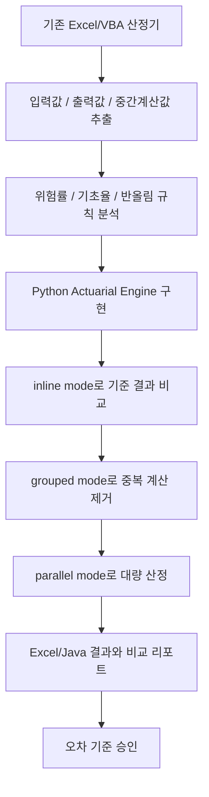

# OCR Life-Table Statistics

보험계리 문서 OCR, 수식 저장, Excel/VBA 보험료 산정 로직의 Python 전환, 그리고 대량 보험료 산정을 위한 성능 개선 샘플 플랫폼입니다.

이 저장소는 다음 목표를 가집니다.

```text
보험계리 문서 PDF/Image OCR
        ↓
본문 + 수식 LaTeX + 공식 카탈로그 DB 저장
        ↓
Excel/VBA 보험료 산정 로직을 Python 계산엔진으로 재구현
        ↓
Batch Engine으로 Excel/CSV 테스트케이스 대량 검증
        ↓
중복 산정조건 Grouping + Memory Cache + 병렬 계산
        ↓
Web Frontend에서 OCR/공식/보험료 산출 결과 확인
```

---

## 1. 전체 구성

```text
.
├── backend/
│   ├── Dockerfile
│   ├── requirements.txt
│   ├── app/
│   │   ├── main.py                         # FastAPI API 서버
│   │   ├── db.py                           # SQLite DB 초기화/조회
│   │   ├── ocr_pipeline.py                 # PDF/Image OCR + 수식 후보 추출
│   │   ├── formula_repair.py               # 계리식 LaTeX 후처리
│   │   ├── formula_catalog.py              # LaTeX 공식과 Python 함수 매핑
│   │   ├── formula_parser.py               # OCR 수식 후보 분류/변수 추출
│   │   ├── formula_parser_examples.py      # 계리식 예시 카탈로그
│   │   ├── actuarial/
│   │   │   ├── life_table.py               # 생명표 로더
│   │   │   ├── commutation.py              # D_x, N_x, M_x 계산
│   │   │   ├── premium.py                  # 보험료 계산
│   │   │   └── reserve.py                  # 준비금 샘플 계산
│   │   ├── batch/
│   │   │   └── run_premium_batch.py        # inline/grouped/parallel Batch 엔진
│   │   └── sample_data/
│   │       ├── life_table.csv
│   │       ├── policies.csv
│   │       └── formula_catalog.json
│   │
├── frontend/
│   ├── Dockerfile
│   ├── index.html
│   └── app.js
│
├── docs/
│   ├── architecture.md
│   ├── excel_vba_migration.md
│   ├── db_schema.md
│   └── parallel_processing_design.md
│
├── docker-compose.yml
└── GITIGNORE_TEMPLATE.txt
```

---

## 2. 시스템 전체 구성도



---

## 3. 보험료 산정 성능 개선 개념

기존 Excel/Java 방식은 보통 아래와 같은 인라인 구조입니다.

```text
입력 1건
  → 위험률/기초율 참조
  → 1차 가공
  → 2차 가공
  → 3차 가공
  → 보험료 계산
  → 결과 저장/비교
```

이 구조가 200만 건 반복되면 같은 위험률, 같은 통근함수, 같은 중간 계산값을 계속 다시 계산할 수 있습니다.

이 프로젝트의 개선 방향은 다음입니다.

```text
초기 데이터 1회 Load
  → Memory Cache 구성
  → D_x / N_x / M_x 사전 계산
  → 동일 산정조건 Grouping
  → Chunk 분할
  → Process 병렬 계산
  → 결과 파일 생성
  → DB Batch Insert는 별도 산출 단계에서 수행
```

---

## 4. 보험료 산정 개선 구성도



핵심 원칙은 **계산 중 DB/Redis를 반복 호출하지 않는 것**입니다.

```text
좋은 구조:
DB 또는 Redis Bulk Load 1회
  → Python Local Memory Cache
  → 계산 루프는 Memory만 사용

나쁜 구조:
200만 건 반복
  → Redis/DB에서 위험률 조회
  → Redis/DB에서 D_x, N_x, M_x 조회
  → 계산
```

---

## 5. Batch 실행 모드

`backend/app/batch/run_premium_batch.py`는 3가지 모드를 지원합니다.

| mode | 설명 | 목적 |
|---|---|---|
| `inline` | 기존 방식처럼 row-by-row 계산 | 원본 기준값 / 검증 기준 |
| `grouped` | 동일 산정조건을 1번만 계산 후 원본에 매핑 | 중복 계산 제거 |
| `parallel` | grouped 결과를 chunk로 나누어 process 병렬 계산 | 대량 산정 성능 개선 |

### inline 실행

```bash
cd backend
python -m app.batch.run_premium_batch \
  --life-table app/sample_data/life_table.csv \
  --policies app/sample_data/policies.csv \
  --output ../outputs/result_inline.csv \
  --mode inline
```

### grouped 실행

```bash
cd backend
python -m app.batch.run_premium_batch \
  --life-table app/sample_data/life_table.csv \
  --policies app/sample_data/policies.csv \
  --output ../outputs/result_grouped.csv \
  --mode grouped
```

### parallel 실행

```bash
cd backend
python -m app.batch.run_premium_batch \
  --life-table app/sample_data/life_table.csv \
  --policies app/sample_data/policies.csv \
  --output ../outputs/result_parallel.csv \
  --mode parallel \
  --chunk-size 50000 \
  --workers 12
```

16 Core 서버 기준 초기 권장값은 아래입니다.

| 항목 | 권장 시작값 |
|---|---:|
| workers | 10 ~ 12 |
| chunk size | 50,000 ~ 100,000 |
| DB batch size | 5,000 ~ 20,000 |

---

## 6. inline / grouped / parallel 비교



검증 순서는 다음을 권장합니다.

```text
1. inline 결과 생성
2. grouped 결과 생성
3. parallel 결과 생성
4. inline vs grouped 비교
5. inline vs parallel 비교
6. Excel 결과 또는 기존 Java 결과와 비교
```

---

## 7. 분산 서버 확장 구조

VM 1대가 아니라 여러 서버에서 수행할 경우에는 서버별로 계산 단계를 나누기보다, **chunk 단위 전체 계산**을 분산하는 것이 우선입니다.



Redis 권장 사용처:

```text
job status
progress
chunk queue
distributed lock
retry state
```

Redis 비추천 사용처:

```text
row-by-row 위험률 조회
row-by-row D_x / N_x / M_x 조회
대량 결과 저장
```

---

## 8. DB 테이블 구조

샘플 DB에는 기존 OCR/공식/Batch 테이블 외에 Job/Chunk 관리용 테이블이 포함됩니다.

| 테이블 | 용도 |
|---|---|
| `documents` | 업로드 문서 관리 |
| `page_content_blocks` | OCR 본문/수식 블록 저장 |
| `formulas` | 공식 카탈로그/OCR 수식 저장 |
| `premium_runs` | 단건/Batch 실행 결과 저장 |
| `premium_calc_jobs` | 대량 보험료 산정 Job 상태 관리 |
| `premium_calc_chunks` | Chunk 단위 처리 상태 관리 |

Job 상태 예시:

```text
REQUESTED
RUNNING
DONE
FAILED
CANCELED
RETRYING
```

Chunk 상태 예시:

```text
READY
RUNNING
DONE
FAILED
RETRY
```

---

## 9. OCR 수식과 보험료 계산의 관계

OCR로 얻은 LaTeX는 직접 실행하지 않습니다.

```text
LaTeX = 표시 / 감사 / 공식 관리 / 승인 workflow
Python function = 실제 보험료 계산 엔진
```

OCR 수식은 아래 용도로 사용합니다.

```text
1. 공식 원문 보관
2. 화면 수식 렌더링
3. 공식명 / 변수명 / 설명 관리
4. Python 함수와 매핑
5. 계리사/개발자 검증
```

실제 보험료 산정은 Python 함수로 구현합니다.

---

## 10. Excel/VBA 전환 전략



가장 중요한 점은 Excel을 바로 없애는 것이 아니라, 처음에는 Excel 결과를 기준값으로 두고 Python 결과와 비교하는 것입니다.

```text
Excel 결과 = 기준값
Python 결과 = 재현 대상
차이 = 반올림 / 참조 / 계산 순서 검증 대상
```

---

## 11. API 샘플

### Health Check

```bash
curl http://localhost:8000/health
```

### 공식 목록

```bash
curl http://localhost:8000/formulas
```

### 계리식 예시 조회

```bash
curl http://localhost:8000/formula-parser/examples
curl "http://localhost:8000/formula-parser/examples?q=reserve"
```

### 수식 후보 파싱

```bash
curl -X POST http://localhost:8000/formula-parser/parse \
  -H "Content-Type: application/json" \
  -d '{"text":"A^1_{x:n} = (M_x - M_{x+n}) / D_x"}'
```

### 보험료 단건 산정

```bash
curl -X POST http://localhost:8000/premium/calculate \
  -H 'Content-Type: application/json' \
  -d '{
    "age": 40,
    "term": 20,
    "sum_assured": 10000000,
    "interest_rate": 0.03,
    "product_type": "term_life"
  }'
```

### 문서 OCR 업로드

```bash
curl -F "file=@sample.pdf" http://localhost:8000/ocr/upload
```

### Batch 실행

```bash
curl -X POST http://localhost:8000/batch/run-sample
```

---

## 12. Docker Compose 실행

```bash
cd OCR_Life-Table-Statistics

docker compose build
docker compose up -d
```

접속:

```text
Frontend: http://localhost:8080
Backend : http://localhost:8000/health
API Docs: http://localhost:8000/docs
```

---

## 13. 로컬 Python 실행

```bash
cd backend
python3 -m venv .venv
source .venv/bin/activate
pip install -r requirements.txt

uvicorn app.main:app --host 0.0.0.0 --port 8000 --reload
```

---

## 14. 현재 샘플 범위

| 영역 | 포함 여부 |
|---|---|
| Frontend Web | 포함 |
| Backend FastAPI | 포함 |
| SQLite DB | 포함 |
| PDF/Image OCR 샘플 | 포함 |
| 수식 LaTeX 후처리 | 포함 |
| 공식 카탈로그 | 포함 |
| 계리식 parser 예시 | 포함 |
| 생명표 CSV 로더 | 포함 |
| 통근함수 D/N/M 계산 | 포함 |
| 순보험료 샘플 계산 | 포함 |
| Batch 산정 엔진 | 포함 |
| inline/grouped/parallel batch mode | 포함 |
| Job/Chunk DB 테이블 | 포함 |
| Excel/VBA 전환 가이드 | 포함 |
| Redis Queue 실제 구현 | 예정 |
| Multi-server Worker | 예정 |
| DB Batch Loader | 예정 |

---

## 15. 운영 확장 방향

```text
SQLite → PostgreSQL / Oracle
CSV 생명표 → DB 기초율 관리
OCR 후보 → 승인 워크플로우
단일 상품 → 상품/특약 모델
Batch CSV → Excel/XLSX 대량 검증
Local Process → Redis Queue + Multi Worker
로컬 Docker → Kubernetes / AKS
```

자세한 병렬 처리 설계는 `docs/parallel_processing_design.md`를 참고하세요.
